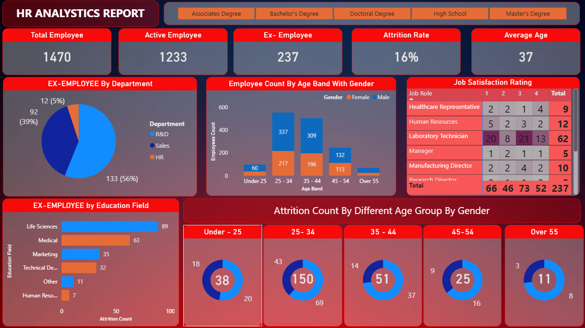

# HR Analytics Dashboard (Power BI) | Attrition Analysis

This Power BI dashboard analyzes employee attrition and workforce trends to help trends to help HR teams make data-diven decisions.

## Tools Used
- Power BI
- Power Query
- DAX

## KPIs
- Total Employees
- Active Employees
- Ex-Employees
- Attrition Rate
- Average Age

## Visualizations
- Employee count by department (Pie Chart)
- Employee count by age band & gender (Column Chart)
- Job satisfaction rating (Matrix)
- Attrition by education field (Bar Chart)
- Attrition by age group (Donut Charts)
- Education filter (Slicer)
 
## Dashboard Preview

